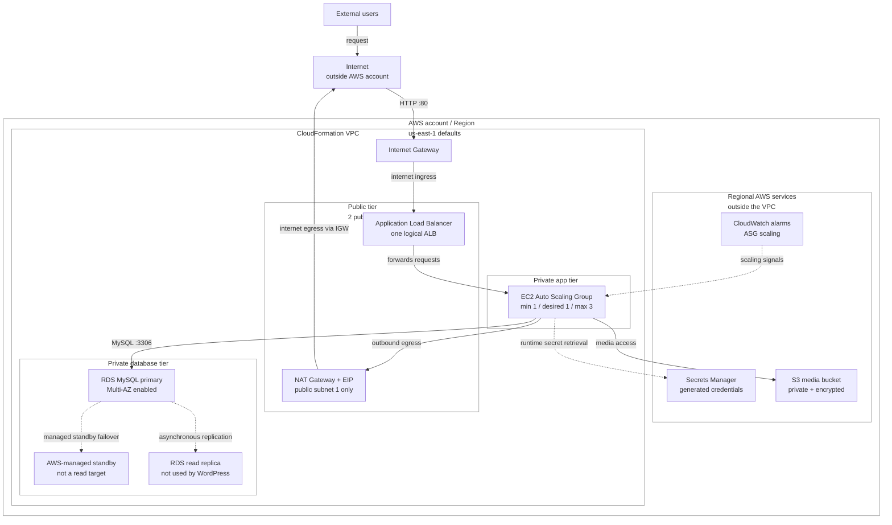

# Multi-AZ WordPress Infrastructure on AWS with CloudFormation

This project defines a two-AZ WordPress environment on AWS using separate CloudFormation networking and application stacks. It combines an internet-facing Application Load Balancer, private EC2 Auto Scaling, RDS MySQL, Secrets Manager, S3, CloudWatch scaling alarms, and least-privilege instance access.

The repository began as a university cloud-computing final project and has been refreshed as an employer-facing infrastructure-as-code portfolio project. The refreshed templates are statically validated, but they were not redeployed during this portfolio refresh.

## Technical Highlights

- Separate networking and application CloudFormation stacks.
- Two public and two private subnets across two Availability Zones.
- Internet-facing ALB with private EC2 targets.
- Cost-conscious ASG defaults with parameterized web-tier capacity.
- RDS MySQL primary with Multi-AZ enabled and a same-region read replica.
- Generated Secrets Manager credentials for database and WordPress bootstrap.
- EC2 runtime secret retrieval through a scoped instance role.
- Private S3 media bucket with public access blocked and encryption enabled.
- CPU-based CloudWatch alarms and Auto Scaling policies.
- Local PowerShell/Bash validation scripts and GitHub Actions CI.

## Architecture



See [docs/architecture.md](docs/architecture.md) and [diagrams/architecture.mmd](diagrams/architecture.mmd) for the fuller architecture notes and Mermaid source.

## AWS Services And Technologies

- AWS CloudFormation
- Amazon VPC, subnets, route tables, Internet Gateway, NAT Gateway, and Elastic IP
- Amazon EC2 Launch Template and Auto Scaling
- Elastic Load Balancing Application Load Balancer
- Amazon RDS for MySQL with Multi-AZ and read replica resources
- AWS Secrets Manager
- Amazon S3
- AWS IAM
- Amazon CloudWatch alarms
- PowerShell, Bash, Python, and `cfn-lint`

## Security Improvements

The refreshed application stack removes password parameters for the main database and WordPress administrator bootstrap flow. CloudFormation now generates Secrets Manager secrets, RDS consumes the database secret through dynamic references, and EC2 retrieves secrets at runtime through a scoped instance role.

Additional controls include IMDSv2, private EC2 and RDS placement, RDS storage encryption, S3 public-access blocking, S3 encryption, a TLS-only S3 bucket policy, no secret outputs, and bootstrap execution without command tracing.

See [docs/security.md](docs/security.md) for implemented controls and remaining limitations.

## Resilience And Scaling

The design is HA-oriented and multi-AZ capable:

- ALB spans two public subnets.
- ASG can place EC2 instances in two private subnets.
- RDS primary has Multi-AZ enabled.
- A same-region read replica is provisioned.
- CPU alarms scale the web tier out and in.

The default web tier is not unconditionally highly available because desired capacity defaults to one instance. Increase `WebMinSize` and `WebDesiredCapacity` to `2` for a two-instance web tier. The design also uses one NAT Gateway by default, which is a cost-conscious trade-off.

## Validation And CI

Validation tooling was added before the documentation refresh:

```powershell
cfn-lint -t networking.yaml application.yaml
cfn-lint --non-zero-exit-code error -t networking.yaml application.yaml
powershell.exe -NoProfile -ExecutionPolicy Bypass -File .\scripts\validate.ps1
```

With Git Bash:

```bash
scripts/validate.sh
```

GitHub Actions runs `cfn-lint==1.52.1` on pull requests, pushes to `main`, and manual dispatch. No AWS credentials are required for validation.

## Repository Structure

```text
.
|-- .github/workflows/validate-cloudformation.yml
|-- application.yaml
|-- networking.yaml
|-- scripts/
|   |-- validate.ps1
|   `-- validate.sh
|-- docs/
|   |-- architecture.md
|   |-- costs.md
|   |-- deployment.md
|   |-- limitations.md
|   |-- security.md
|   `-- teardown.md
|-- diagrams/
|   `-- architecture.mmd
`-- parameters/
    |-- application.example.json
    `-- networking.example.json
```

## Deployment Order

At a high level:

1. Validate both templates locally.
2. Deploy `networking.yaml`.
3. Deploy `application.yaml` using the networking stack name.
4. Acknowledge IAM creation for the application stack with `CAPABILITY_IAM`.
5. Inspect stack outputs without exposing secrets.

Use [docs/deployment.md](docs/deployment.md) for command examples and [docs/teardown.md](docs/teardown.md) before creating any billable resources.

## Documentation

- [Architecture](docs/architecture.md)
- [Deployment](docs/deployment.md)
- [Teardown](docs/teardown.md)
- [Security](docs/security.md)
- [Costs](docs/costs.md)
- [Limitations](docs/limitations.md)

## Cost Warning

This project can incur significant AWS charges. Main cost drivers include NAT Gateway, Elastic IP, ALB, EC2, RDS primary, RDS Multi-AZ standby, RDS read replica, snapshots, Secrets Manager, S3, CloudWatch, and data transfer. Review [docs/costs.md](docs/costs.md) before deploying.

## Project Status

- Templates pass static CloudFormation linting.
- Local PowerShell and Bash validation scripts exist.
- GitHub Actions validation exists.
- No lint findings are currently expected.
- The portfolio refresh was performed without deploying AWS resources.
- Runtime behavior remains unverified until a controlled deployment is performed.

## Known Limitations

- Refreshed templates were not deployed during this work.
- Static validation is not deployment proof.
- The default AMI and `vockey` key pair are AWS Academy lab-oriented defaults.
- Repository-defined IAM may not be allowed in restricted learner labs.
- Default ASG desired capacity is one instance.
- One NAT Gateway creates an Availability Zone dependency.
- ALB is HTTP only; no ACM certificate, HTTPS listener, Route 53, or WAF is included.
- WordPress is not configured to use the read replica for application reads.
- No automated secret rotation or tested migration path is included.

See [docs/limitations.md](docs/limitations.md) for the full list.
