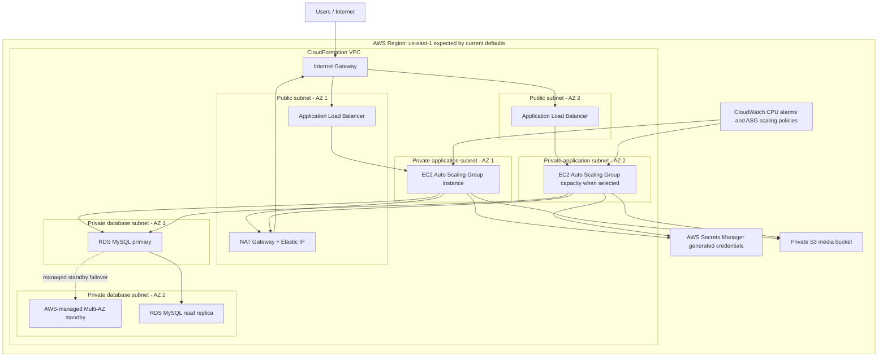

# Architecture

This project defines a two-Availability-Zone WordPress environment with separate CloudFormation stacks for networking and application resources. The architecture is HA-oriented and multi-AZ capable, but the default web tier remains cost-conscious with one desired EC2 instance.

## Networking Stack

[networking.yaml](../networking.yaml) creates the network foundation:

- One VPC with DNS support and DNS hostnames enabled.
- Two public subnets, one in each of the first two Availability Zones.
- Two private subnets, one in each of the first two Availability Zones.
- An Internet Gateway for public ingress and egress.
- One NAT Gateway in public subnet 1 for private subnet outbound access.
- One public route table associated with both public subnets.
- One private route table associated with both private subnets.
- Stack outputs exported for use by the application stack.

The single NAT Gateway is a deliberate cost-conscious default. It also creates an Availability Zone dependency for outbound private-subnet traffic.

## Application Stack

[application.yaml](../application.yaml) imports the VPC and subnet IDs exported by the networking stack. It provisions:

- Security groups for the ALB, web tier, and database tier.
- A private S3 media bucket with public access blocked and AES256 server-side encryption.
- Generated Secrets Manager secrets for database credentials and the WordPress administrator password.
- RDS MySQL primary database with Multi-AZ enabled.
- A same-region RDS read replica.
- An internet-facing Application Load Balancer and HTTP listener.
- A launch template for private EC2 instances.
- A repository-defined EC2 role and instance profile.
- An Auto Scaling Group across both private application subnets.
- CPU-based CloudWatch alarms and simple scaling policies.

## Cross-Stack Exports

The networking stack exports the VPC ID, subnet IDs, route table IDs, Internet Gateway ID, NAT Gateway ID, and VPC CIDR. The application stack imports these values using `Fn::ImportValue` and the `NetworkStackName` parameter.

Deploy the networking stack first. The application stack cannot resolve its imports until the networking stack exports exist.

## Traffic Paths

Internet traffic enters through the Internet Gateway and reaches the public Application Load Balancer. The ALB forwards HTTP traffic to EC2 instances in the private application subnets through the web security group.

The EC2 instances use the NAT Gateway for outbound package downloads, AWS API calls, and other egress from private subnets. Because there is only one NAT Gateway, outbound access depends on the public subnet and Availability Zone that host that NAT Gateway.

WordPress connects to the RDS primary endpoint. The current bootstrap configures the primary database endpoint in `wp-config.php`; it does not configure WordPress to route application reads to the read replica.

## Database Behavior

The RDS primary has `MultiAZ: true`, which means AWS manages a standby for database failover. That standby is not a read target for the WordPress application.

The read replica is a separate RDS instance sourced from the primary. It can support read-scaling or reporting patterns, but this template does not configure WordPress to use it. Its presence should not be described as automatic application read failover.

The primary uses `DeletionPolicy: Snapshot` and `UpdateReplacePolicy: Snapshot`. The read replica remains disposable and can be recreated from the primary.

## Credential Flow

The application stack creates two Secrets Manager secrets:

- `DatabaseCredentialsSecret` stores a generated database password and the configured database username.
- `WordPressAdminCredentialsSecret` stores a generated WordPress administrator password.

RDS consumes the database secret through Secrets Manager dynamic references. EC2 instances retrieve both secrets at runtime using their instance role. Resolved secret values are not stored in CloudFormation parameters, launch template user data, or stack outputs.

## EC2 Instance Role

The `WordPressInstanceRole` allows EC2 to call only:

- `secretsmanager:DescribeSecret`
- `secretsmanager:GetSecretValue`

The policy resources are scoped to the two secrets created by the application stack. No customer-managed KMS key is used, so no explicit `kms:Decrypt` permission is included.

## S3 Media Bucket

The media bucket is private, encrypted, and configured with public access blocking and a bucket policy denying insecure transport. The EC2 bootstrap attempts to activate the `amazon-s3-and-cloudfront` plugin if it is already installed, but full S3 media offload behavior still requires deployment verification.

## Scaling Behavior

The Auto Scaling Group spans both private application subnets. Defaults are:

- `WebMinSize`: `1`
- `WebDesiredCapacity`: `1`
- `WebMaxSize`: `3`

This keeps the default deployment cost-conscious. Set desired and minimum capacity to `2` for a multi-instance web tier. CPU alarms scale out at 70 percent average CPU and scale in at 25 percent average CPU.

## Failure Boundaries

Implemented resilience:

- ALB spans two public subnets.
- ASG can place instances in two private subnets.
- RDS primary has Multi-AZ enabled.
- RDS read replica exists as a separate replica resource.

Known boundaries:

- Default ASG desired capacity is one instance.
- One NAT Gateway creates an egress dependency on one AZ.
- ALB listener is HTTP only.
- WordPress does not automatically use the read replica.
- No live deployment or disaster-recovery test was performed during the portfolio refresh.
